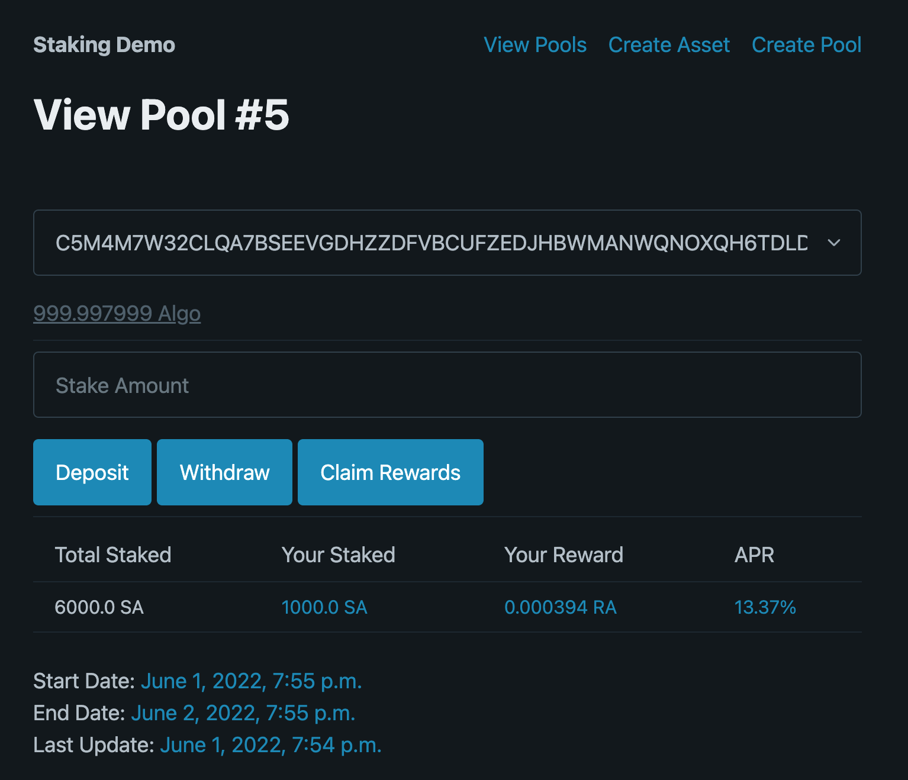

# Staking Demo

This repository contains a Django demo of a staking contract and user interface
for users to stake an asset in return for a reward which accrues depending on
their amount and duration staked.

Please note this is not a production ready example and is purely for
educational purposes. The rate of return is a fixed rate, regardless of the
number of stakers. There is also no conversion between the value of the staked
assest and the value of the reward asset. For this you would need an oracle.
When deploying a new pool it is assumed that the full total supply of the
reward asset is being deposited into the contract.

## Running the Demo

It is assumed you are using sandbox running a private sandnet chain (not
Testnet or Mainnet). If you have `DevMode` enabled, you should set it to false
and clear/restart your sandbox environment so that block progress at a constant
rate and the global timestamp moves forward.

Make sure you update `./staking/view.py` and set the `deployer` variable to an
address you control and want to be the authorised pool deployer.

Launch the demo with the following command.

`./manage.py runserver`

Now visit http://127.0.0.1:8000/ to test.

## Smart Contract Testing

Navigate into `./staking/contracts/` to read the TEAL and run the associated
bash scripts.

Use the `./deploy.sh` script to run through all the features of the contract.

Use the `./update.sh` script to update the smart contract if you've modified it.

## Design Flow

**Deployer**

 * Deployer deploys a new staking pool contract, specifying:
   * Staking Asset
	 * Reward Asset
	 * Begin Timestamp
	 * End Timestamp
 * Deployer initialises staking pool:
   * Funding minimum balance requirement
   * Allowing pool opt in to assets
 * Deployer sets reward rate:
	 * Sending reward assets

(The last two steps, `initialise` and `reward` can be combined into a single
group transaction)

**User**

 * User has Token A.
 * User opts in to staking app.
 * User deposits Token A into staking app.
 * User accrues Token B over time, based on their staked size and duration.
 * User can withdraw Token A and Token B at any time.

**Security**
 * Admin may pause the staking pool at any time
 * If paused, the admin may update the smart contract

## Implementation

### Frontend

A Django (Python) web interface allowing users to connect their wallet and see
what they have staked and their accrued rewards.

The reward rate needs to be implemented the same way as the smart contract, so
that a real-time count of the rewards is matched to what a smart contract would
provide should the user withdraw at the same moment.

### Smart Contracts

A single stateful smart contract is deployed per staking pool. This allows the
smart contract to contain both the logic and also hold the funds (staked assets
and rewards) to keep things simpler.

